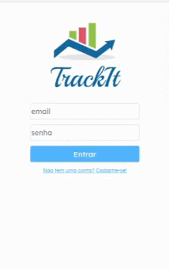

<h1 align="center">
   :ledger: <a href="#"> Track it </a>
</h1>

<h3 align="center">
    Record and track your week habits!
</h3>

<h4 align="center"> 
	 Status: Finished
</h4>

<p align="center">
 <a href="#about">About</a> •
 <a href="#layout">Layout</a> • 
 <a href="#pre-requisites">Pre-requisites</a> • 
 <a href="#tech-stack">Tech Stack</a> • 
 <a href="#how-to-contribute">How to contribute</a> • 
 <a href="#author">Author</a>
</p>


## About

Aimed at helping you build good habits and reach your goals.

---

## How it works

Develop the front end using an preexistent active API.

---


## Layout

<div align="center">
 
</div>


This layout was inspired by <a href="https://www.figma.com/file/3r8MSf9dIPuFlvZHuHTZXF/TrackIt?node-id=0%3A1">this</a> Figma prototype.


---


## Pre-requisites

Before you begin, you will need to have the following tools installed on your machine:
[Git](https://git-scm.com), [Node.js](https://nodejs.org/en/), [VSCode](https://code.visualstudio.com/).

### Running the Frontend


``` jsx

// Clone this repository
$ git clone git@github.com:RafaelaMirabile/Trackit.git

// Access the project folder cmd/terminal
$ cd Trackit

// Install the dependencies
$ npm install

// If you want to run your app on localhost, create a .env file (same as the env.example) with the environment variable pointing to your local server.

// Run the application in development mode
$ npm start

// The server will start at port: 3000

```


---

## Tech Stack

The following tools were used in the construction of the project:

**Frontend**  ([React](https://reactjs.org/))

-   **[Axios](https://github.com/axios/axios)**
-   **[DotEnv](https://github.com/dotenv-org)**
-   **[React-circular-progress-bar](https://github.com/kevinsqi/react-circular-progressbar/blob/master/README_v1.md)**
-   **[React-loader-spinner](https://github.com/mhnpd/react-loader-spinner)**
-   **[React-router-dom](https://github.com/remix-run/react-router)**
-   **[Styled-components](https://github.com/styled-components/styled-components)**
-   **[SweetAlert2](https://github.com/sweetalert2/sweetalert2)**
-   **[Dayjs](https://github.com/dayjs)**


> See the file  [package.json](https://github.com/RafaelaMirabile/Trackit/blob/main/package.json)


---


## How to contribute

1. Fork the project.
2. Create a new branch with your changes: `git checkout -b feat/myFeatureName`
3. For each feature implemented, make a commit specifying what was done
4. Submit your changes: `git push -u origin feat/myFeatureName`

---

## Author

Developed by Rafaela C. Mirabile.
